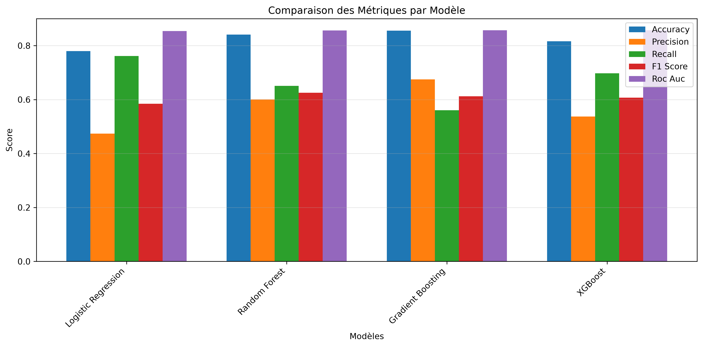
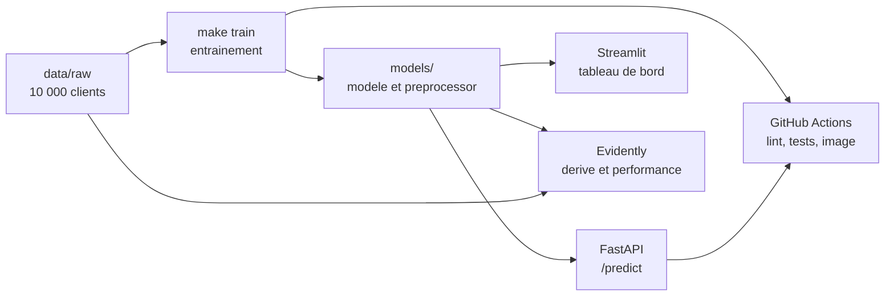

# Prédiction du churn bancaire — pipeline MLOps

[](https://github.com/DenisMT22/bank-churn-mlops/actions/workflows/ci-cd.yml)
[](https://python.org)
[](https://fastapi.tiangolo.com)
[](LICENSE)

Identifier les clients d'une banque sur le point de partir, de l'entraînement
du modèle jusqu'à une API conteneurisée et un tableau de bord, avec tests,
scan de secrets et détection de dérive.

Le projet est **local d'abord** : tout tourne sur une machine de
développement en une commande, sans compte cloud.

```bash
make setup    # dépendances puis entraînement complet
make api      # API sur http://localhost:8080
make dashboard
```



---

## Sommaire

- [Aperçu](#aperçu)
- [Démo en ligne](#démo-en-ligne)
- [Fonctionnalités](#fonctionnalités)
- [Architecture](#architecture)
- [Démarrage rapide](#démarrage-rapide)
- [Jeu de données](#jeu-de-données)
- [Modèle](#modèle)
- [API](#api)
- [Docker](#docker)
- [Local d'abord, prêt pour le cloud](#local-dabord-prêt-pour-le-cloud)
- [Monitoring](#monitoring)
- [Intégration continue](#intégration-continue)
- [Structure du projet](#structure-du-projet)
- [Technologies](#technologies)
- [Licence](#licence)


---

## Aperçu

### Contexte Business

ABC Multistate Bank fait face à un **taux de churn de 20%**, générant des pertes significatives. Ce projet développe une solution d'IA prédictive permettant d'identifier les clients à risque de départ **avant** qu'ils ne partent.

### Objectif

Manquer un client sur le point de partir coûte plus cher qu'alerter à tort
sur un client fidèle : une fausse alerte déclenche une offre de rétention,
un départ non détecté fait perdre le client. Le modèle est donc optimisé
sur le **recall**, quitte à accepter une précision basse.

Tous les chiffres de ce README proviennent de `models/model_metadata.json`
et de `models/model_comparison.json`, régénérés par `make train-complet`.

### Solution Déployée

```
📊 Données → 🤖 Modèle ML → 🐳 Docker → ☁️ GCP Cloud Run → 📈 Monitoring
     ↓            ↓            ↓              ↓               ↓
  Kaggle      Logistic      Container      Production       Evidently
            Regression
```

---

## Démo en ligne

Le tableau de bord est déployable gratuitement sur **Streamlit Community
Cloud**, sans serveur ni carte bancaire. Il charge le modèle dans son propre
processus, et le régénère depuis la donnée versionnée s'il ne le trouve pas.

Pour le déployer sur votre propre compte :

1. Créer un compte sur [share.streamlit.io](https://share.streamlit.io) et le
   relier à GitHub.
2. Cliquer sur **New app**, choisir ce dépôt et la branche `main`.
3. Renseigner `streamlit_app.py` comme fichier principal.
4. Choisir Python 3.12 ; les dépendances de `requirements.txt` sont
   installées automatiquement.
5. Déployer. Le premier démarrage entraîne le modèle, ce qui prend quelques
   secondes.

Aucune configuration n'est nécessaire : le jeu de données source est
versionné, donc l'application est autonome. Pour la faire pointer vers une
API distante plutôt que sur le modèle local, définir `API_URL` dans les
secrets de l'application.

---

## Fonctionnalités

### Machine learning
- ✅ Exploration des données (EDA)
- ✅ Feature engineering : 14 variables créées, 27 features vues par le modèle
- ✅ Gestion du déséquilibre par SMOTE **et** `class_weight="balanced"`
- ✅ Comparaison de 4 modèles (LR, RF, GB, XGBoost)
- ✅ Interprétabilité par les coefficients du modèle

### API et déploiement
- ✅ API REST avec FastAPI
- ✅ Documentation Swagger/OpenAPI automatique
- ✅ Conteneurisation Docker
- ✅ Déploiement serverless sur GCP Cloud Run
- ✅ Auto-scaling (0 à 10 instances)

### MLOps
- ✅ Pipeline CI/CD avec GitHub Actions
- ✅ Tests automatisés (pytest)
- ✅ Scan de secrets (gitleaks, en pre-commit et en CI)
- ✅ Monitoring avec Evidently (détection de dérive)
- ✅ Pipeline de réentraînement déclenché sur seuil
- ✅ Versioning des modèles par horodatage

### Interface
- ✅ Dashboard Streamlit interactif
- ✅ Prédictions en temps réel
- ✅ Visualisations des KPIs
- ✅ Recommandations d'actions

### Non implémenté

Ces briques appartiennent à un pipeline MLOps complet mais ne sont pas
présentes dans ce dépôt. Elles sont listées ici pour ce qu'elles sont :
des pistes, pas des fonctionnalités.

| Piste | État |
|-------|------|
| Rollback automatique en cas d'échec de déploiement | Non configuré : la CI signale l'échec sans revenir en arrière |
| Déploiement canary et A/B testing | Non implémenté |
| Mesure de latence et de disponibilité en production | Aucune instrumentation en place |
| Optimisation des hyperparamètres | Les modèles utilisent des valeurs fixées à la main |

---

## Architecture



Une seule donnée est versionnée : le fichier source. Le preprocessor, le
modèle et le jeu enrichi sont tous régénérés par `make train`, en trois
secondes environ.

Le détail — flux des données, pipeline d'entraînement, chaîne
d'intégration continue, boucle de monitoring — est dans
[docs/architecture.md](docs/architecture.md).

---

## Démarrage rapide

### Prérequis

- Python 3.12
- Docker, facultatif

### Installation

```bash
git clone https://github.com/DenisMT22/bank-churn-mlops.git
cd bank-churn-mlops

make install        # environnement virtuel et dépendances
make train          # entraîne le modèle retenu, environ 3 s
make test           # 62 tests
```

Le jeu de données source est versionné : il n'y a rien à télécharger.

`make train` régénère le preprocessor, le modèle, les métriques et le jeu
enrichi. `make train-complet` compare les quatre modèles et reproduit les
figures, en une minute environ.

```bash
make api            # API sur http://localhost:8080
make dashboard      # tableau de bord sur http://localhost:8501
make monitor        # rapports de dérive Evidently
make lint           # ruff
make scan           # recherche de secrets avec gitleaks
make aide           # liste des cibles
```

### Interfaces locales

| Interface | Adresse |
|-----------|---------|
| Documentation interactive de l'API | http://localhost:8080/docs |
| Documentation alternative | http://localhost:8080/redoc |
| État de l'API | http://localhost:8080/health |
| Tableau de bord | http://localhost:8501 |

---

## Jeu de données

### Source

**Bank Customer Churn Dataset**, déposé par gauravtopre sur
[Kaggle](https://www.kaggle.com/datasets/gauravtopre/bank-customer-churn-dataset).
Le jeu décrit une banque fictive et ne contient aucune donnée personnelle
réelle. Il est versionné dans `data/raw/` pour que le projet soit
reproductible sans téléchargement.

### Caractéristiques

| Propriété | Valeur |
|-----------|--------|
| Observations | 10 000 |
| Colonnes | 12 (identifiant, 10 variables, cible) |
| Target | `churn` (0/1) |
| Déséquilibre | 79.6% / 20.4% (7 963 / 2 037) |

### Variables

| Variable | Type | Description |
|----------|------|-------------|
| customer_id | int | Identifiant client, écarté à l'entraînement |
| credit_score | int | Score de crédit (300-900) |
| country | cat | Pays (France/Germany/Spain) |
| gender | cat | Genre (Male/Female) |
| age | int | Âge du client |
| tenure | int | Ancienneté (années) |
| balance | float | Solde du compte |
| products_number | int | Nombre de produits |
| credit_card | bin | Possède carte crédit |
| active_member | bin | Membre actif |
| estimated_salary | float | Salaire estimé |
| **churn** | bin | **Target - A quitté (1) ou non (0)** |

---

## Modèle

### Comparaison des Modèles

Le script `train.py` compare automatiquement 4 algorithmes et sélectionne le meilleur basé sur le **Recall** :

| Modèle | Accuracy | Precision | Recall ⭐ | F1-Score | ROC-AUC |
|--------|----------|-----------|----------|----------|---------|
| **Logistic Regression** 🏆 | 77.95% | 47.40% | **76.17%** | 58.44% | 85.39% |
| XGBoost | 81.60% | 53.69% | 69.78% | 60.68% | 85.69% |
| Random Forest | 84.10% | 60.09% | 65.11% | 62.50% | 85.65% |
| Gradient Boosting | 85.55% | 67.46% | 56.02% | 61.21% | 85.73% |

> **🏆 Gagnant : Logistic Regression** avec un Recall de 76.17%

> Ces vingt valeurs sont écrites par `make train-complet` dans
> `models/model_comparison.json`. Aucune n'est saisie à la main.

### Pourquoi Logistic Regression ?

Bien que d'autres modèles aient une meilleure Accuracy, **Logistic Regression** a été sélectionné car :

1. **Meilleur Recall (76.17%)** : Détecte le plus de churners
2. **Interprétabilité** : Coefficients explicables pour le métier
3. **Rapidité** : Inférence ultra-rapide en production
4. **Robustesse** : Moins de risque d'overfitting

### Matrice de Confusion (Test Set : 2,000 samples)

```
              Prédit 0    Prédit 1
Réel 0         1,249         344      (TN / FP)
Réel 1            97         310      (FN / TP)
```

**Interprétation :**
- **310 churners correctement identifiés** (True Positives)
- **97 churners manqués** (False Negatives) - à minimiser
- **344 fausses alertes** (False Positives) - acceptables

### Métriques du Modèle Retenu

Mesurées sur le jeu de test de 2 000 clients, jamais vu à l'entraînement.

| Métrique | Score |
|----------|-------|
| **Recall** | 76.17% |
| **Precision** | 47.40% |
| **F1-Score** | 58.44% |
| **ROC-AUC** | 85.39% |
| **Accuracy** | 77.95% |
| Recall en validation croisée | 75.71% ± 2.90% |

Une précision de 47% signifie qu'environ une alerte sur deux est une fausse
alerte. C'est le prix assumé du recall élevé, et le principal axe
d'amélioration du modèle.

> Source : `models/model_metadata.json`, régénéré par `make train`.

### Variables les Plus Influentes

Une régression logistique n'expose pas de `feature_importances_` : ce sont
ses coefficients qui portent l'information. Appliqués à des variables
standardisées, ils se comparent entre eux. Un coefficient positif pousse
vers le départ, un coefficient négatif vers la fidélité.

| Variable | Coefficient | Lecture |
|----------|-------------|---------|
| `HasMultipleProducts` | −3.58 | Détenir plusieurs produits retient fortement |
| `products_number` | +2.58 | Mais le nombre brut de produits joue en sens inverse |
| `balance` | +1.33 | Un solde élevé accompagne les départs |
| `BalancePerProduct` | −1.32 | Rapporté au nombre de produits, l'effet s'inverse |
| `age` | +1.28 | Les clients plus âgés partent davantage |
| `active_member` | −0.65 | Un membre actif reste |

Les deux premières lignes se lisent ensemble : le modèle distingue le fait
d'avoir plusieurs produits du nombre exact de produits détenus.

> Extraits de `models/trained/model_latest.pkl` après `make train`.

---

## API

### Endpoints

#### `GET /health`
Vérifier l'état de l'API.

```bash
curl http://localhost:8080/health
```

**Réponse :**
```json
{
  "status": "healthy",
  "model_loaded": true,
  "model_version": "2025-11-19T14:30:00",
  "uptime_seconds": 3600.5
}
```

#### `GET /metrics`
Obtenir les métriques du modèle.

```bash
curl http://localhost:8080/metrics
```

#### `POST /predict`
Prédire le churn pour un client.

```bash
curl -X POST "http://localhost:8080/predict" \
  -H "Content-Type: application/json" \
  -d '{
    "credit_score": 650,
    "country": "France",
    "gender": "Female",
    "age": 35,
    "tenure": 5,
    "balance": 125000.0,
    "products_number": 2,
    "credit_card": 1,
    "active_member": 1,
    "estimated_salary": 50000.0
  }'
```

**Réponse :**
```json
{
  "churn_prediction": 0,
  "churn_probability": 0.234,
  "risk_level": "Low",
  "confidence": 0.766,
  "timestamp": "2025-11-19T16:40:15"
}
```

#### `POST /predict/batch`
Prédictions pour plusieurs clients (max 1000).

---

## Docker

### Build et Run

```bash
# Build l'image
docker build -f deployment/Dockerfile -t churn-api:latest .

# Run le conteneur
docker run -d -p 8080:8080 --name churn-api churn-api:latest

# Vérifier les logs
docker logs -f churn-api

# Arrêter
docker stop churn-api && docker rm churn-api
```

### Docker Compose

```bash
cd deployment
docker-compose up -d
```

---

## Local d'abord, prêt pour le cloud

Le projet a été déployé sur Google Cloud Run pendant son développement.
L'abonnement associé n'est plus actif : **aucune instance n'est en ligne**,
et le dépôt ne prétend pas le contraire. Tout fonctionne en local, et le
chemin vers le cloud reste documenté.

### Correspondance

| Brique locale | Équivalent Google Cloud |
|---------------|-------------------------|
| `make api`, conteneur Docker | Cloud Run |
| `models/` sur le disque | Cloud Storage |
| Image Docker locale | Artifact Registry |
| Journaux dans le terminal | Cloud Logging |
| `make train` lancé à la main | Cloud Build ou Vertex AI Pipelines |

### Réactiver le déploiement

Le job `deploy` de la CI et le workflow de réentraînement existent toujours,
mais ne se déclenchent **que manuellement**, depuis l'onglet Actions. Pour
les remettre en service :

```bash
./scripts/setup_gcp.sh    # projet, compte de service, buckets
```

Puis définir dans les réglages du dépôt les secrets `GCP_PROJECT_ID` et
`GCP_SA_KEY`.

Le script écrit la clé du compte de service dans
`~/.config/bank-churn-mlops/`, **jamais dans le dépôt**. En local,
`gcloud auth application-default login` évite d'avoir une clé sur le disque.

---

## Monitoring

### Evidently AI

Le monitoring utilise Evidently pour détecter :
- **Data Drift** : Changements dans la distribution des features
- **Model Drift** : Dégradation des performances
- **Data Quality** : Valeurs manquantes, outliers

### Génération des Rapports

```bash
make monitor
```

Les rapports HTML sont générés dans `src/monitoring/reports/`, qui n'est pas
versionné : ces fichiers pèsent plusieurs mégaoctets et sont régénérés à
chaque exécution.

### Alertes Configurées

| Métrique | Seuil | Action | Défini dans |
|----------|-------|--------|-------------|
| Recall | < 70% | Réentraînement | `evidently_monitor.py` |
| Colonnes en dérive | > 30% | Alerte dans le rapport | `evidently_monitor.py` |

---

## Intégration continue

Trois mécanismes coexistent, à des degrés d'automatisation différents.
Le tableau ci-dessous dit lequel tourne réellement.

| Mécanisme | Déclenchement | État |
|-----------|---------------|------|
| Intégration continue | Automatique, à chaque poussée | **Actif** |
| Déploiement du tableau de bord | Automatique, à chaque poussée | **Actif** une fois le dépôt connecté |
| Déploiement de l'API sur Cloud Run | Manuel uniquement | **En sommeil** |

### Intégration continue — active

À chaque poussée et à chaque pull request, GitHub Actions exécute le lint,
les tests, le scan de secrets et la construction de l'image Docker. C'est
gratuit sur un dépôt public.

Le cœur du pipeline ne dépend d'aucun compte cloud : les quatre premiers
jobs tournent entièrement sur le runner GitHub.

| Job | Contenu | Bloquant |
|-----|---------|----------|
| `secret-scan` | gitleaks sur tout l'historique et sur les fichiers | oui |
| `lint` | ruff pour le style, bandit pour la sécurité statique | oui |
| `test` | entraînement réel puis pytest | oui |
| `docker-build` | build de l'image, démarrage, `/health` et une prédiction | oui |
| `deploy` | Cloud Run — **déclenchement manuel uniquement** | non |

Aucun filtre de chemin n'est appliqué : chaque poussée déclenche l'ensemble
du pipeline, y compris le scan de secrets. Un filtre laisserait passer sans
contrôle un commit ne touchant pas à `src/`, ce qui est exactement le cas
d'une clé déposée à la racine.

Le job `test` entraîne réellement le modèle depuis `data/raw` avant de
lancer la suite, puis compare les métriques régénérées à celles versionnées.
Il n'y a plus ni `continue-on-error`, ni artefacts factices.

### Tests

62 tests, répartis en trois fichiers :

| Fichier | Portée |
|---------|--------|
| `test_preprocessing.py` | Création des features, encodage, cohérence des colonnes |
| `test_model.py` | Chargement des artefacts, forme des sorties, déterminisme, métriques |
| `test_api.py` | Endpoints, validation des entrées, gestion des erreurs |

Couverture mesurée : **25 % des lignes de `src/`**. Le détail est plus
parlant que le total : `schemas.py` 100 %, `preprocessing.py` 70 %,
`api/main.py` 40 %, tandis que `train.py`, `retrain.py` et
`evidently_monitor.py` sont à 0 % — ce sont des scripts exécutés de bout
en bout, non couverts par des tests unitaires. C'est le chiffre réel,
pas un objectif.

```bash
make test                                  # la suite
pytest tests/ --cov=src --cov-report=term  # avec la couverture
```

### Déploiement continu du tableau de bord — actif

Une fois le dépôt connecté à Streamlit Community Cloud, chaque poussée sur
`main` redéploie automatiquement le tableau de bord. C'est le seul
déploiement continu réellement en service sur ce projet, et il est gratuit.

Le tableau de bord est autonome : il charge le modèle dans son propre
processus et le régénère depuis la donnée versionnée. Aucun serveur ni
secret n'est nécessaire. La marche à suivre est dans la section
[Démo en ligne](#démo-en-ligne).

### Déploiement de l'API sur Cloud Run — en sommeil

Le job `deploy` construit l'image, la pousse sur Artifact Registry et
déploie sur Cloud Run. Il ne se déclenche **que manuellement**, depuis
l'onglet Actions :

```yaml
if: github.event_name == 'workflow_dispatch'
```

L'abonnement Google Cloud associé au projet n'est plus actif : **aucune
instance n'est en ligne**. Le code du déploiement est conservé parce qu'il a
fonctionné et qu'il documente le chemin vers le cloud, pas parce qu'il
tourne aujourd'hui.

La condition porte sur l'événement et non sur la présence d'un secret :
GitHub n'évalue pas le contexte `secrets` dans la condition d'un job, une
garde de ce type serait décorative.

### Réentraînement — manuel

`.github/workflows/retrain.yml` suit la même logique. Il se déclenchait
auparavant chaque lundi et à chaque modification de `data/raw` ; comme
toutes ses étapes passent par Cloud Storage, il échouait à chaque
exécution. Il est passé en déclenchement manuel.

En local, le réentraînement fonctionne sans cloud :

```bash
python -m src.models.retrain
```

---

## Structure du projet

```
bank-churn-mlops/
├── data/
│   ├── raw/Bank_Churn_Prediction.csv   # seule donnée versionnée
│   └── processed/                      # régénéré par make train
├── models/
│   ├── model_metadata.json             # métriques, source de vérité
│   ├── model_comparison.json           # comparaison des quatre modèles
│   ├── preprocessor.pkl                # régénéré
│   └── trained/                        # régénéré
├── src/
│   ├── api/            # FastAPI : main.py, schemas.py
│   ├── models/         # preprocessing.py, train.py, retrain.py
│   ├── monitoring/     # evidently_monitor.py
│   └── utils/          # config.py, chemins du projet
├── tests/              # test_api.py, test_model.py, test_preprocessing.py
├── notebooks/01_eda.ipynb
├── deployment/         # Dockerfile, docker-compose.yml, cloudbuild.yaml
├── scripts/            # setup_gcp.sh, deploy.sh
├── docs/               # architecture.md et figures
├── .github/workflows/  # ci-cd.yml, retrain.yml
├── streamlit_app.py    # tableau de bord
├── Makefile
├── requirements.txt        # exécution
├── requirements-dev.txt    # tests et qualité
└── requirements-gcp.txt    # cloud, optionnel
```

Les artefacts marqués « régénéré » ne sont pas versionnés : `make train` les
reconstruit depuis la donnée source.

---

## Technologies

### Machine Learning


### API & Backend


### DevOps & Cloud


### Monitoring & Visualisation


---

## Licence

Distribué sous licence MIT. Voir [LICENSE](LICENSE).

Le jeu de données provient de Kaggle et reste soumis aux conditions de son
auteur.
