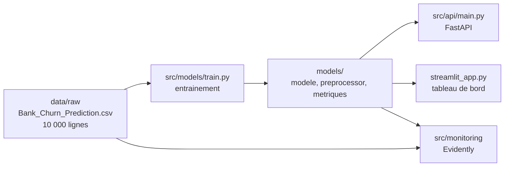
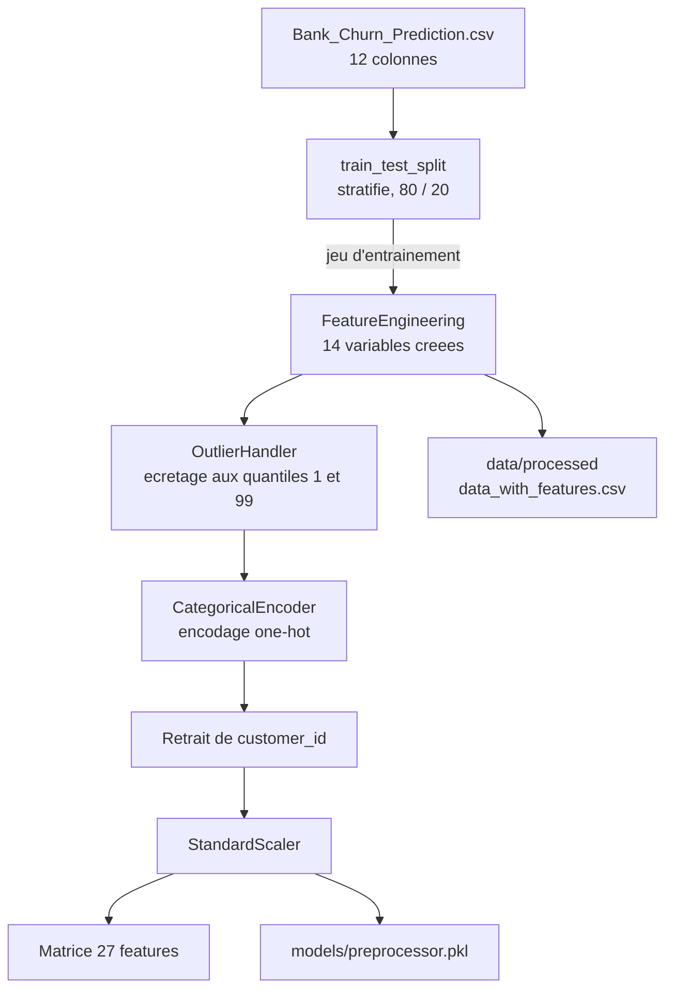
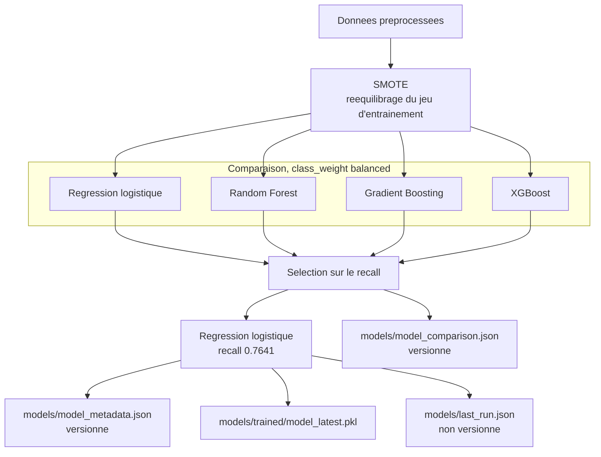
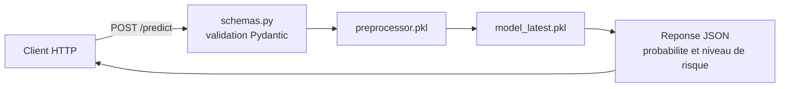
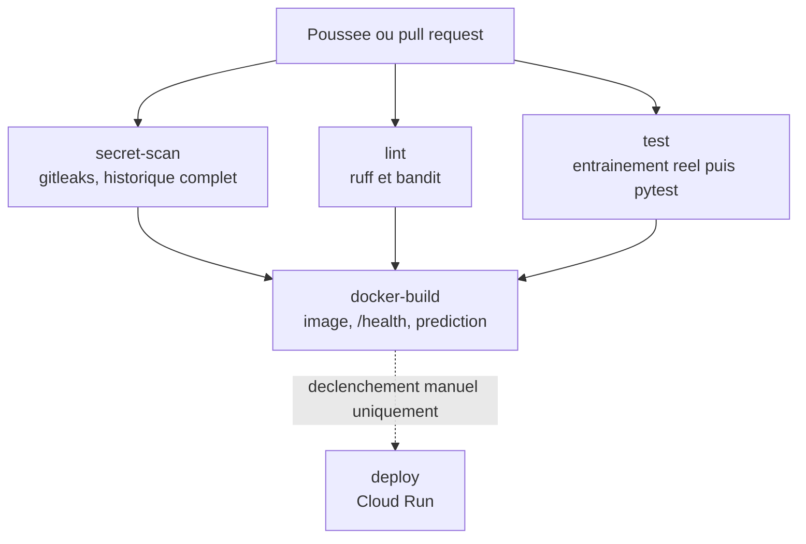
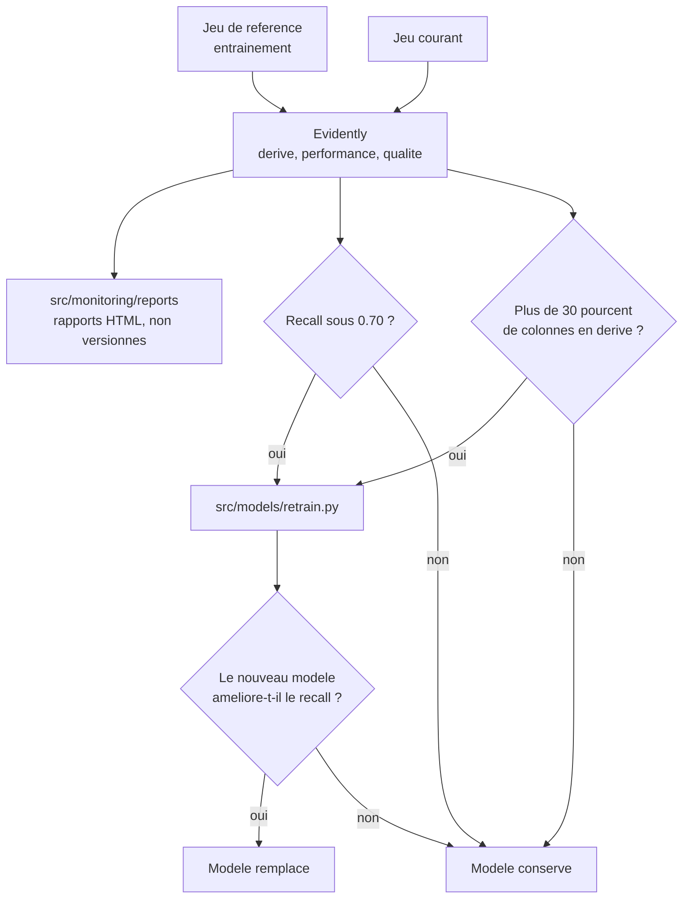

# Architecture

Ce document décrit le système tel qu'il existe dans ce dépôt. Les briques
non implémentées sont listées en fin de page plutôt que dessinées comme si
elles fonctionnaient.

Le projet est **local d'abord** : l'entraînement, l'API, le tableau de bord
et le monitoring tournent sur une machine de développement sans aucun
compte cloud. Le déploiement Cloud Run existe encore dans le dépôt mais
n'est déclenchable qu'à la main.

---

## Vue d'ensemble

Une seule donnée est versionnée : le fichier source. Tout le reste est
régénéré par `make train`, en environ trois secondes.

---

## Flux de données

Du fichier brut aux 27 features vues par le modèle.

Le preprocessor est ajusté **sur le seul jeu d'entraînement**, puis appliqué
au jeu de test. C'est ce qui évite que des informations du test fuient dans
l'apprentissage.

Les 14 variables créées sont trois ratios — `BalancePerProduct`,
`AgeToTenureRatio`, `SalaryPerAge` —, quatre indicateurs binaires —
`IsSenior`, `IsYoung`, `HasZeroBalance`, `HasMultipleProducts` —, six
tranches mutuellement exclusives de score de crédit et d'ancienneté, et une
interaction entre activité et nombre de produits.

---

## Pipeline d'entraînement

Le déséquilibre des classes est traité **deux fois** : par SMOTE sur le jeu
d'entraînement, et par `class_weight="balanced"` dans les modèles.

La sélection se fait sur le **recall** et non sur l'accuracy. Gradient
Boosting atteint 85,6 % d'accuracy mais ne détecte que 56 % des départs ;
la régression logistique plafonne à 78 % d'accuracy mais en détecte 76 %.
Manquer un client qui part coûte plus cher qu'une fausse alerte.

Le fichier d'horodatage est séparé des métriques pour que le fichier
versionné reste stable d'une exécution à l'autre.

---

## Service de prédiction

Le tableau de bord Streamlit sait fonctionner de deux manières : en
chargeant le modèle directement dans son propre processus, ce qui lui
permet d'être hébergé seul, ou en appelant l'API si la variable `API_URL`
est définie.

Les seuils de risque sont fixés à 0,3 et 0,6 sur la probabilité de départ.

---

## Chaîne d'intégration continue

Les quatre premiers jobs ne référencent aucun secret Google Cloud : le
pipeline est vert ou rouge selon l'état du code, jamais selon celui d'un
abonnement cloud.

Aucun filtre de chemin n'est appliqué. Un filtre laisserait passer sans
contrôle un commit ne touchant pas à `src/`, ce qui est exactement le cas
d'une clé déposée à la racine.

Le job de tests entraîne le modèle depuis la donnée versionnée, puis
compare les métriques régénérées à celles du dépôt. Un écart arrête le
pipeline.

---

## Monitoring et réentraînement

Le réentraînement se lance à la main, par `python -m src.models.retrain`.
Le workflow GitHub correspondant existe mais reste en sommeil : il passe
par Cloud Storage, donc par un compte cloud.

Un nouveau modèle ne remplace l'ancien que s'il améliore le recall d'au
moins deux points.

---

## Ce qui n'est pas implémenté

| Brique | État |
|--------|------|
| Déploiement Cloud Run | Code présent, déclenchement manuel, abonnement inactif |
| Rollback automatique | Non configuré ; la CI signale l'échec sans revenir en arrière |
| Déploiement progressif, test A/B | Non implémenté |
| Registre de modèles type MLflow | Non utilisé ; le versionnement se fait par horodatage de fichier |
| Mesure de latence et de disponibilité | Aucune instrumentation |
| Réentraînement planifié | Le workflow existe mais n'est plus déclenché automatiquement |

---

## Correspondance local vers cloud

Si le déploiement était réactivé, chaque brique locale aurait son
équivalent managé.

| Local | Équivalent Google Cloud |
|-------|-------------------------|
| `make api`, conteneur Docker | Cloud Run |
| `models/` sur le disque | Cloud Storage |
| Image Docker locale | Artifact Registry |
| Journaux dans le terminal | Cloud Logging |
| `make train` à la main | Cloud Build ou Vertex AI Pipelines |
